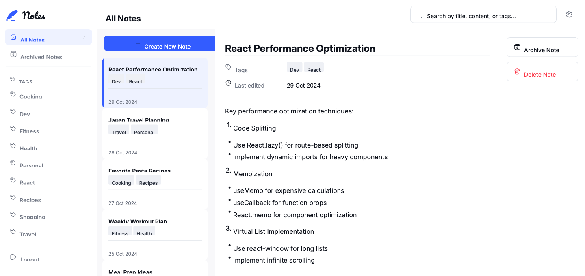
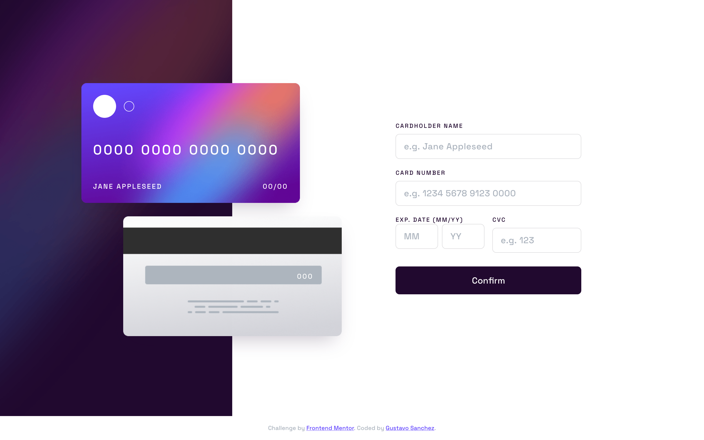
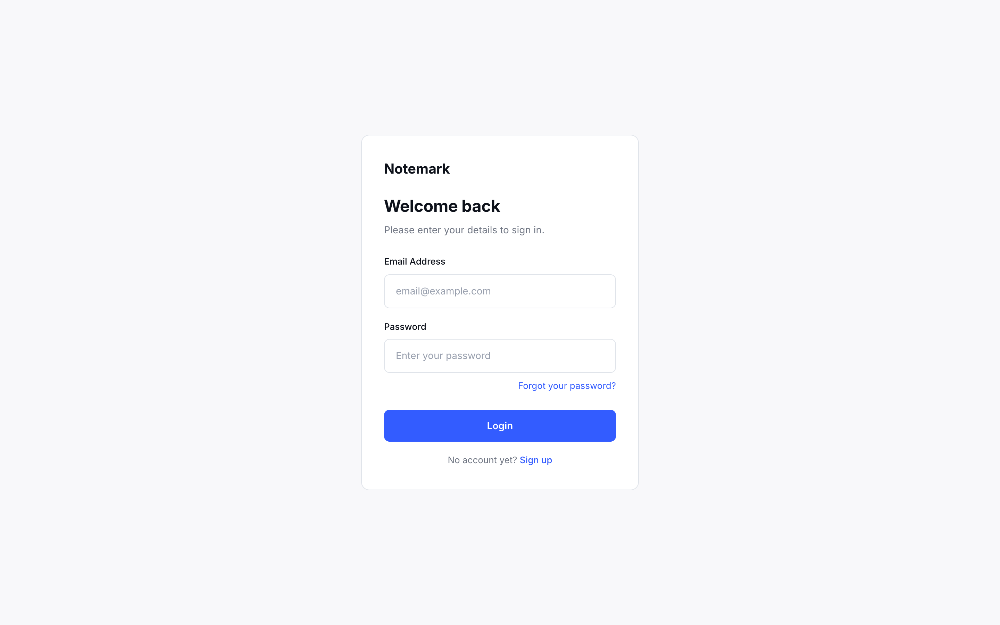
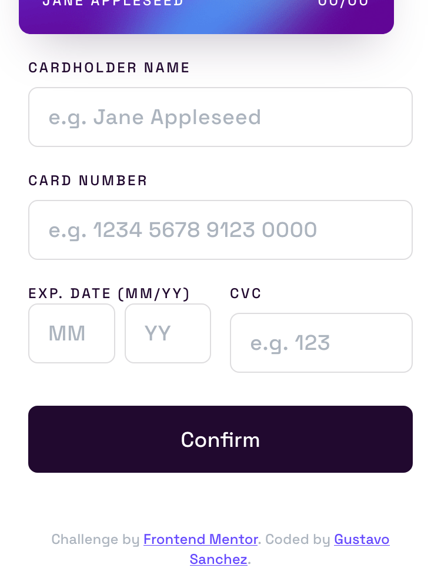
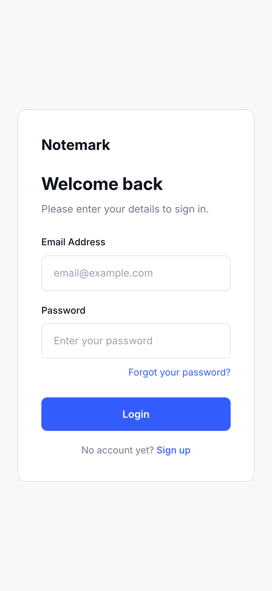

# Frontend Mentor - Note-taking web app solution

This is a solution to the [Note-taking web app challenge on Frontend Mentor](https://www.frontendmentor.io/challenges/note-taking-web-app-773r7bUfOG). Frontend Mentor challenges help you improve your coding skills by building realistic projects.

## Table of contents

- [Overview](#overview)
  - [The challenge](#the-challenge)
  - [Screenshots](#screenshots)
  - [Links](#links)
- [My process](#my-process)
  - [Built with](#built-with)
  - [What I learned](#what-i-learned)
  - [Continued development](#continued-development)
  - [Useful resources](#useful-resources)
  - [AI Collaboration](#ai-collaboration)
- [Author](#author)

## Overview

### The challenge

Users should be able to:

- Create, read, update, and delete notes
- Archive notes
- View all their notes
- View all archived notes
- View notes with specific tags
- Search notes by title, tag, and content
- Select their color theme (light / dark / system)
- Select their font theme (sans-serif / serif / monospace)
- Receive validation messages if required form fields aren't completed
- Navigate the whole app and perform all actions using only their keyboard
- View the optimal layout for the interface depending on their device's screen size
- See hover and focus states for all interactive elements on the page
- **Bonus**: Create an account, log in, and reset their password (localStorage-based auth simulation)

### Screenshots

**Desktop (1440px)**







**Mobile (375px)**

 

### Links

- Solution URL: [Add solution URL here](https://your-solution-url.com)
- Live Site URL: [Add live site URL here](https://your-live-site-url.com)

## My process

### Built with

- Semantic HTML5 markup (`header`, `nav`, `main`, `aside`, `article`, `section`)
- CSS custom properties (design tokens in `variables.css`)
- CSS Modules for component-scoped styles
- CSS Grid (3-column desktop shell)
- Flexbox (sidebar, note cards, meta bar)
- Responsive design: 1440px desktop → 768px tablet → 375px mobile
- [React 19](https://react.dev/) with TypeScript
- [Vite](https://vitejs.dev/) — build tool and dev server
- [React Router v6](https://reactrouter.com/) — client-side routing and auth guard
- [react-markdown](https://github.com/remarkjs/react-markdown) — markdown preview in note viewer
- Context API + `useReducer` for notes state with localStorage persistence
- [Vitest](https://vitest.dev/) + [@testing-library/react](https://testing-library.com/) — unit and component tests

### What I learned

**CSS `data-*` attribute selectors for mobile view toggling**

Rather than conditionally rendering panels in React (which causes layout thrashing), I applied a `data-mobile-view` attribute to the shell and toggled visibility purely in CSS:

```css
[data-mobile-view='list'] > .detail { display: none; }
[data-mobile-view='detail'] > .list { display: none; }
```

This keeps the DOM stable while giving React full control of the state.

**Portal-based accessible dialog**

The `ConfirmDialog` uses `createPortal` to render outside the note panel, with `role="alertdialog"`, focus trap, and Escape key handling — all without a third-party modal library.

**`useReducer` + localStorage as a lightweight store**

A single reducer handles CREATE / UPDATE / DELETE for notes. Persisting to localStorage in a `useEffect` that subscribes to state kept the logic simple and testable in isolation without mocking React.

```ts
function reducer(state: Note[], action: Action): Note[] {
  switch (action.type) {
    case 'CREATE': return [action.note, ...state];
    case 'UPDATE': return state.map(n => n.id === action.id ? { ...n, ...action.patch } : n);
    case 'DELETE': return state.filter(n => n.id !== action.id);
  }
}
```

### Continued development

- Replace the localStorage auth simulation with a real backend (Node.js / Supabase) to fulfil the full-stack bonus requirement.
- Add note sharing and collaboration features.
- Explore optimistic UI updates and offline support via a service worker.

### Useful resources

- [React `createPortal` docs](https://react.dev/reference/react-dom/createPortal) — essential for the accessible modal dialog
- [WAI-ARIA Authoring Practices — Dialog Pattern](https://www.w3.org/WAI/ARIA/apg/patterns/dialog-modal/) — guided the focus trap and keyboard behaviour
- [CSS Modules with Vite](https://vitejs.dev/guide/features.html#css-modules) — zero-config scoped styles

### AI Collaboration

This project was built with Claude Code (claude.ai/code) as an AI pair-programmer.

**What worked well:**
- Claude planned the full 15-commit roadmap, breaking the challenge into isolated, reviewable slices (design tokens → shell → notes CRUD → auth → responsive → tests → README).
- Generating boilerplate for Context providers, CSS Module files, and test suites was significantly faster with AI assistance.
- When browser automation screenshots failed (download path not accessible), Claude switched to injecting `html2canvas` from CDN and later to `capture-website-cli` — iterating until the approach worked.

**What to watch:**
- AI-generated CSS sometimes needed a second pass to match the Figma specs exactly (especially spacing and icon alignment at tablet breakpoints).
- Always verify generated test files run green before committing — a few tests needed environment adjustments (`jsdom` vs Node for localStorage mocks).

## Author

[](https://www.linkedin.com/in/gustavosanchezgalarza/)
[](https://github.com/gusanchefullstack)
[](https://hashnode.com/@gusanchedev)
[](https://x.com/gusanchedev)
[](https://bsky.app/profile/gusanchedev.bsky.social)
[](https://www.freecodecamp.org/gusanchedev)
[](https://www.frontendmentor.io/profile/gusanchefullstack)
